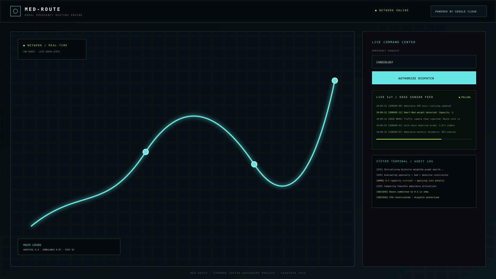

# MED-ROUTE — Rural Healthcare Routing

**CodeRush 2026 · Official Problem #04 · Rural Healthcare: The Doctor, Ambulance & Medicine Routing Problem**

> **MED-ROUTE is a browser-native emergency decision engine:** qualify the hospital, compute the route, allocate the ambulance, and expose the reasoning — all inside one live command center.

## Dashboard



The preview mirrors the production visual language: live network map, dispatch controls, audit terminal, and the new IoT/edge telemetry surface.

## Live Demo

- **Production:** https://med-route-coderush.onrender.com
- **Repository:** https://github.com/1032250431-hub/Bardhangng

## Why MED-ROUTE

A hospital is not the right destination merely because it is nearby. MED-ROUTE evaluates the full operational state before committing a dispatch:

- requested medical specialty;
- on-duty specialist availability;
- bed capacity;
- medicine stock;
- urgency/SLA constraints;
- road closures and dynamic graph state;
- ambulance availability; and
- weighted travel cost.

The command center exposes the decision trace so the result is **explainable rather than a black box**.

## Technology Stack

### Core decision engine

- **JavaScript (ES2022+)** — browser-authoritative application and routing engine.
- **Custom Binary Min Heap** — array-backed priority queue with O(log V) insertion and extraction.
- **Dijkstra's algorithm** — weighted shortest-path computation.
- **Web Workers** — isolates large graph/scale calculations from the UI thread.
- **Deterministic healthcare state model** — hospitals, ambulances, roads, requests and resource mutations.

### Mapping & visualization

- **Leaflet 1.9.4** — interactive network map, markers, route polylines and map events.
- **OpenStreetMap tiles** — free keyless geographic basemap.
- **GSAP 3.12.2** — route choreography, UI transitions and micro-interactions.
- **HTML5 + CSS3** — tactical command-center interface.
- **Space Grotesk / IBM Plex Mono / DM Sans** — display, telemetry and body typography.

### Edge / IoT narrative layer

- **Live IoT Sensor Feed** — simulated edge-device telemetry presented as an operator-facing stream.
- **Edge-node event model** — GPS, smart-bed, traffic-camera, cold-chain, battery, LoRa and oxygen telemetry examples.
- **MQTT / local-bus visual language** — communicates how roadside and hospital sensors could feed the routing engine.
- **Real-time audit terminal** — shows routing/dispatch computation as an observable event stream.

### Platform / delivery

- **Node.js 18+** — lightweight production HTTP server and test runner.
- **Render** — production hosting.
- **GitHub Actions** — automated test execution.
- **Google Cloud & Firebase** — judge-facing Google technology integration/branding layer in the command center. The routing engine itself remains local and does not require a Google Maps API key or paid routing service.

## IoT & Edge Computing Architecture

The IoT layer turns MED-ROUTE from a static routing visualization into an **edge-aware emergency operations concept**.

```text
Ambulance GPS ───────┐
Smart Bed Sensor ────┤
Traffic Camera ──────┤
Cold-chain Probe ────┼──> Edge Gateway ──> Routing State ──> Dijkstra
Oxygen Monitor ─────┤                           │
LoRa Road Sensor ───┘                           └──> Dispatch / ETA
```

The production UI currently uses a deterministic **synthetic sensor stream** rather than claiming a physical-device connection. Each event is rendered as if it arrived from an edge node, for example:

```text
[SENSOR-88] Ambulance GPS sync: Lat/Long updated
[SENSOR-12] Smart-Bed weight detected: Capacity -1
[EDGE-NODE] Traffic camera feed ingested: Route cost +2
```

This gives judges a clear bridge between **IoT sensing → edge ingestion → routing graph state → dispatch decision**, while keeping the core routing engine reproducible in a browser-only environment.

## How Dijkstra + Binary Heap Works

### 1. Model the healthcare network as a weighted graph

Every village, intersection and hospital is a graph node. Roads are edges with travel-time weights. A road can also be marked blocked, in which case Dijkstra ignores that edge during the next search.

### 2. Start with infinite tentative distance

For an emergency origin `S`, the engine initializes:

```text
distance[S] = 0
distance[every other node] = ∞
```

The origin is inserted into a **min-priority queue**.

### 3. Extract the cheapest node

Instead of sorting every candidate repeatedly, MED-ROUTE uses an array-backed **Binary Min Heap**. The node with the smallest current travel cost is extracted in O(log V).

### 4. Relax its outgoing roads

For every available edge `u → v` with travel cost `w`:

```text
candidate = distance[u] + w

if candidate < distance[v]:
    distance[v] = candidate
    previous[v] = u
    push(v, candidate)
```

If a cheaper route is discovered, the heap receives the updated candidate.

### 5. Reconstruct the route

Once the destination is selected, the `previous` pointers are followed backwards from hospital → origin and reversed to produce the dispatch path.

### 6. Apply healthcare feasibility

Shortest distance is **not** automatically the winning hospital. MED-ROUTE first checks specialty, specialist availability, beds, medicine, SLA and reachability. The remaining feasible candidates are compared using the routing cost model.

```text
Composite Cost = Travel Time + Low-Bed Wait Penalty
```

This is the key distinction between a generic map shortest-path demo and an emergency healthcare decision engine.

### Complexity

With a binary heap, the weighted shortest-path search is approximately:

- **Time:** O((V + E) log V)
- **Graph storage:** O(V + E)
- **Heap insertion/extraction:** O(log V)
- **Heap peek:** O(1)

## Live Command Center

The operator dashboard exposes the engine as a live system rather than a prerecorded animation:

- **Network / Real-Time** map state with live node topology.
- **Emergency Request** specialty and dispatch controls.
- **Live IoT / Edge Sensor Feed** with simulated incoming hardware telemetry.
- **System Terminal / Audit Log** showing algorithmic decision stages.
- **Hospital capacity** and medicine state.
- **Ambulance fleet** availability and dispatch state.
- **Route visualization** with animated dispatch path.
- **Road closure** injection and graph rerouting.
- **Judge Scenario Deck** for a fast end-to-end demonstration.
- **Scale Lab** for 50k-node / 200k-edge stress testing.

## Judge Scenario Deck

The command center includes executable scenarios designed for a 3–5 minute judging window:

1. **Qualified Hospital Routing** — specialty, doctor, capacity, medicine, SLA and travel-cost evaluation.
2. **Nearest Specialist Unavailable** — proves that distance alone does not determine the destination.
3. **All Ambulances Occupied** — validates the queue/failure contract without false dispatch.
4. **Hospital Full / Medicine Depleted** — demonstrates resource-feasibility rejection.
5. **Dynamic Road Closure** — blocks a graph edge and triggers rerouting.
6. **Concurrent Critical Influx** — exercises shared live resources.

The scenario layer is designed to drive the real engine and surface its resulting state rather than simply playing back a fixed video or static log.

## Scale / Resilience Test

The Scale Lab runs a browser benchmark in a Web Worker using:

- **50,000 graph nodes**
- **200,000 weighted road edges**
- multiple Dijkstra searches using the binary heap
- **5,000 emergency-priority arrivals**
- runtime measured in the judge's browser

The Worker boundary keeps large calculations away from the command-center interaction path.

## Network & Failure Philosophy

MED-ROUTE is designed to remain useful when the network is imperfect:

- map tile errors are handled without crashing the dispatch UI;
- GeoJSON-dependent flows can fall back to local mock structures;
- routing decisions remain browser-local;
- road closures are represented directly in graph state;
- failed dispatches return an explicit state instead of pretending a mission succeeded.

## Accessibility & Responsive Design

The interface includes:

- semantic labels for interactive controls;
- ARIA labels for dynamically created buttons and controls;
- `aria-live` audit/telemetry regions where appropriate;
- stacked command-center layout below tablet widths;
- `dvh` mobile viewport handling;
- touch-friendly Leaflet pan/zoom behavior;
- no horizontal overflow for fleet, hospital or telemetry panels.

## Testing

Run the automated suite:

```bash
npm test
```

The tests cover:

- binary heap ordering;
- graph generation and node/edge structure;
- hospital and ambulance counts;
- invalid origin/specialty handling;
- successful routing and dispatch;
- hospital bed/medicine mutation;
- ambulance state mutation;
- fleet exhaustion and `QUEUED_NO_AMBULANCE` behavior.

GitHub Actions runs the engine tests on repository changes.

## Run Locally

### Requirements

- Node.js **18+**
- Modern Chromium, Firefox or Safari

### Start

```bash
git clone https://github.com/1032250431-hub/Bardhangng.git
cd Bardhangng
npm test
npm start
```

Then open `http://localhost:3000`.

There is no runtime API-key configuration required for the routing engine.

## Repository Structure

```text
core-engine.js          # Graph, binary heap, Dijkstra, dispatch/state engine
app.js                  # Browser application + Leaflet command center
index-final.html        # Production UI
server.js               # Production/local HTTP server + asset injection
iot-edge-pass.js        # IoT / edge telemetry presentation layer
architecture-pass.js    # Architecture/performance pass
architecture-hooks.js   # Production UI, audit terminal and judge hooks
judge-scenarios.js      # Live judge scenario deck
stress-benchmark.js     # Scale benchmark worker/controller
hardware-performance.js # Browser hardware/performance utilities
final-overrides.js      # Final production UI overrides
docs/dashboard-preview.svg # Repository dashboard preview
.github/workflows/      # CI test workflow
package.json            # Run/test scripts
```

## AI-Assisted Development

- **OpenAI ChatGPT** — engineering, architecture, algorithm, performance, UX and debugging copilot.
- **Google Gemini** — additional UI/code ideation and refinement.

AI tools assisted development; the repository contains the source required to run the application and the routing engine remains the authoritative decision system.

## Submission Checklist

- [x] Live production deployment
- [x] Interactive routing engine
- [x] Dijkstra + Binary Min Heap explanation
- [x] Hospital / ambulance state mutation
- [x] Explainable audit trail
- [x] IoT + Edge Computing narrative
- [x] Live synthetic sensor feed
- [x] Responsive/mobile command center
- [x] Accessibility pass
- [x] Judge Scenario Deck
- [x] Scale / resilience benchmark
- [x] Google Cloud & Firebase judge-facing integration badge
- [x] Dashboard preview in README
